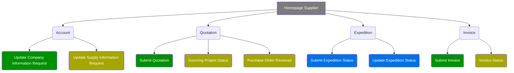

# HW4
SupplyEase Organization Diagram

```mermaid
graph TD
    %% Style Definitions
    classDef homepage fill:#7B7B7B,stroke-width:2px,color:#fff
    classDef greenBox fill:#009100,stroke-width:2px,color:#fff
    classDef yellowBox fill:#A6A600,stroke-width:2px,color:#fff
    classDef blueBox fill:#0072E3,stroke-width:2px,color:#fff

    B1["Create Purchase Request"]:::greenBox
    B2["Create Purchase Order"]:::yellowBox
    B3["Create Material Code"]:::greenBox
    B4["Create Expedite"]:::yellowBox
    B5["Create Payment"]:::blueBox

    C1["PR - PO Status"]:::greenBox
    C2["Delivery Status"]:::yellowBox
    C3["Payment Status"]:::blueBox
    C4["Real-Time Statistics"]:::blueBox

    D1["Sourcing Project"]:::yellowBox

    E1["Supplier Information"]:::greenBox
    E2["Supplier Request / Registration"]:::yellowBox
    E3["Supplier Ranking / Grouping"]:::yellowBox
    E4["Supplier Bidding History"]:::blueBox

    G1["Login / Signup"]:::greenBox
    G2["User Profile"]:::yellowBox
    G3["Log Out"]:::greenBox

    A[Homepage Internal]:::homepage --> B(Create);
    A --> C(Status);
    A --> D(Bidding);
    A --> E(Supplier);
    A --> F(HELP);
    A --> G(ACCOUNT);

    %% Create Menu
    B --> B1(Create Purchase Request);
    B --> B2(Create Purchase Order);
    B --> B3(Create Material Code);
    B --> B4(Create Expedite);
    B --> B5(Create Payment);

    %% Status Menu
    C --> C1(PR - PO Status);
    C --> C2(Delivery Status);
    C --> C3(Payment Status);
    C --> C4(Real-Time Statistics);

    %% Bidding Menu
    D --> D1(Sourcing Project);

    %% Supplier Menu
    E --> E1(Supplier Information);
    E --> E2(Supplier Request / Registration);
    E --> E3(Supplier Ranking / Grouping);
    E --> E4(Supplier Bidding History);

    %% Account Menu
    G --> G1(Login / Signup);
    G --> G2(User Profile);
    G --> G3(Log Out);


```

```mermaid
graph TD
    %% Style Definitions
    classDef homepage fill:#7B7B7B,stroke-width:2px,color:#fff
    classDef greenBox fill:#009100,stroke-width:2px,color:#fff
    classDef yellowBox fill:#A6A600,stroke-width:2px,color:#fff
    classDef blueBox fill:#0072E3,stroke-width:2px,color:#fff
    classDef loginBox fill:#2d5016,stroke-width:3px,color:#fff

    I1["Update Company Information Request"]:::greenBox
    I2["Update Supply Information Request"]:::yellowBox
    
    J1["Submit Quotation"]:::greenBox
    J2["Sourcing Project Status"]:::yellowBox
    J3["Purchase Order Recieved"]:::yellowBox

    K1["Submit Expedition Status"]:::blueBox
    K2["Update Expedition Status"]:::blueBox

    L1["Submit Invoice"]:::greenBox
    L2["Invoice Status"]:::yellowBox

    H[Homepage Supplier]:::homepage-->I(Account);
    H --> J(Quotation);
    H --> K(Expedition);
    H --> L(Invoice);

    %% Account
    I --> I1(Update Company Information Request);
    I --> I2(Update Supply Information Request);

    %% Quotation
    J --> J1(Submit Quotation);
    J --> J2(Sourcing Project Status);
    J --> J3(Purchase Order Recieved);

    %% Expedition
    K --> K1(Submit Expedition Status);
    K --> K2(Update Expedition Status);

    %% Invoicing
    L --> L1(Submit Invoice);
    L --> L2(Invoice Status);
```

