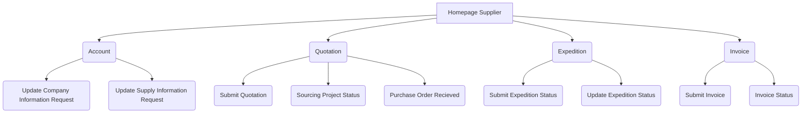

# HW4
SupplyEase Organization Diagram

```mermaid
graph TD

    A[Homepage Internal] --> B(Create);
    A --> C(Status);
    A --> D(Bidding);
    A --> E(Supplier);
    A --> F(HELP);
    A --> G(ACCOUNT);

    %% Create Menu
    B --> B1(Create Purchase Request);
    B --> B2(Create Purchase Order);
    B --> B3(Create Material Code);
    B --> B4(Create Expedite);
    B --> B5(Create Payment);

    %% Status Menu
    C --> C1(PR - PO Status);
    C --> C2(Delivery Status);
    C --> C3(Payment Status);
    C --> C4(Real-Time Statistics);

    %% Bidding Menu
    D --> D1(Sourcing Project);

    %% Supplier Menu
    E --> E1(Supplier Information);
    E --> E2(Supplier Request / Registration);
    E --> E3(Supplier Ranking / Grouping);
    E --> E4(Supplier Bidding History);

    %% Account Menu
    G --> G1(Login / Signup);
    G --> G2(User Profile);
    G --> G3(Log Out);
```

```mermaid
graph TD
    H[Homepage Supplier]-->I(Account);
    H --> J(Quotation);
    H --> K(Expedition);
    H --> L(Invoice);

    %% Account
    I --> I1(Update Company Information Request);
    I --> I2(Update Supply Information Request);

    %% Quotation
    J --> J1(Submit Quotation);
    J --> J2(Sourcing Project Status);
    J --> J3(Purchase Order Recieved);

    %% Expedition
    K --> K1(Submit Expedition Status);
    K --> K2(Update Expedition Status);

    %% Invoicing
    L --> L1(Submit Invoice);
    L --> L2(Invoice Status);
```

